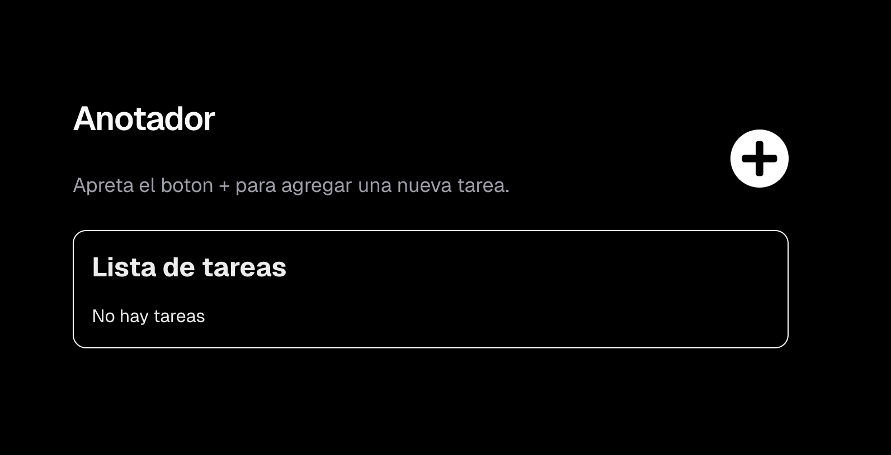
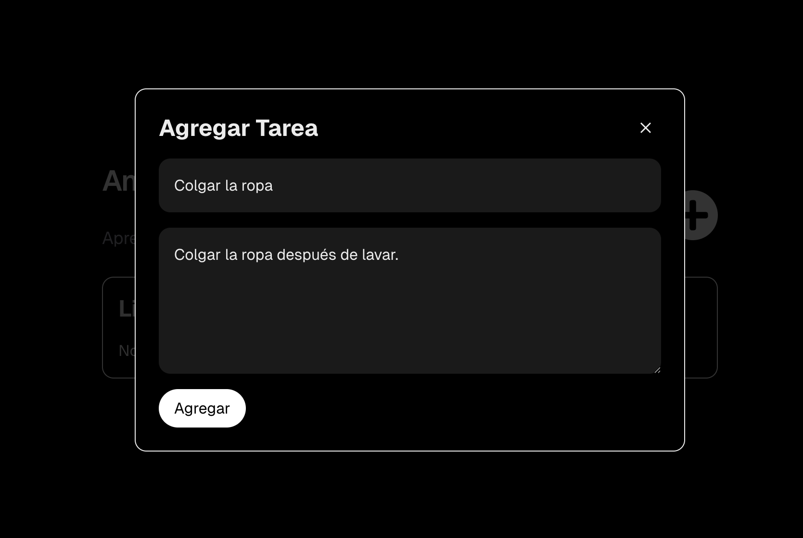
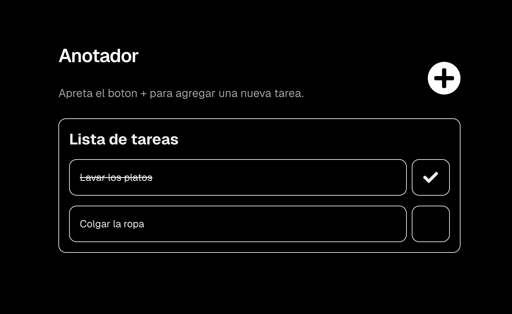
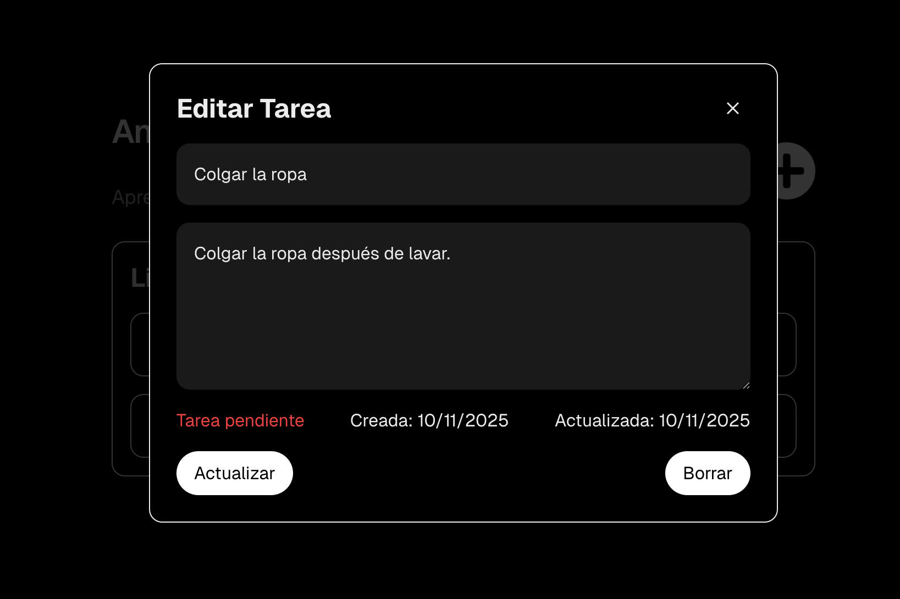
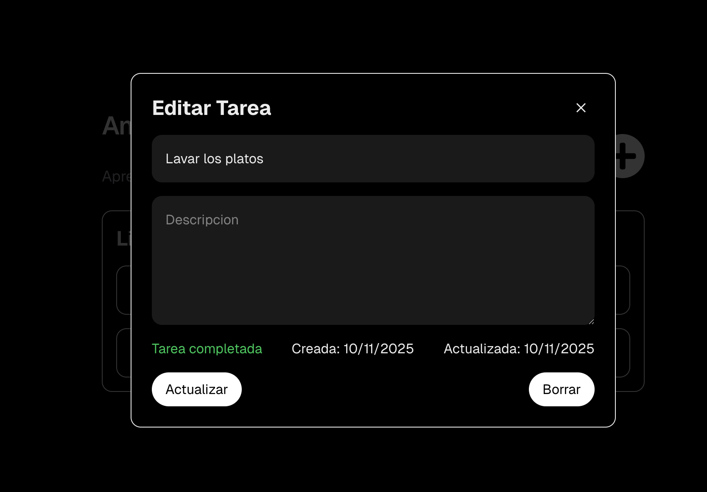

# 📝 ToDo App

Aplicación web para gestionar tareas, desarrollada con **Next.js**, **TypeScript**, **TailwindCSS** y **SQLite**.  
Permite crear, listar, editar, marcar como completadas y eliminar tareas, con persistencia local en base de datos.

---

## 🚀 Tecnologías utilizadas

- [Next.js (App Router)] — Framework fullstack basado en React  
- [React + TypeScript] — Componentes con tipado estricto  
- [TailwindCSS] — Estilos rápidos y personalizables  
- [SQLite] — Base de datos ligera local  
- API Routes — Endpoints del backend integrados en Next.js  
- Fetch API — Comunicación entre frontend y backend  

---

## ⚙️ Instalación y ejecución

### 1️⃣ Clonar el repositorio
```bash
git clone https://github.com/tu-usuario/todo-app.git
cd todo-app

### 2️⃣ Instalar dependencias
```bash
npm install
```

### 3️⃣ Ejecutar la aplicación
```bash
npm run dev
```

### 4️⃣ Acceder a la aplicación
Abre tu navegador y ve a `http://localhost:3000` para ver la aplicación.

---

## Funcionamiento capturas






